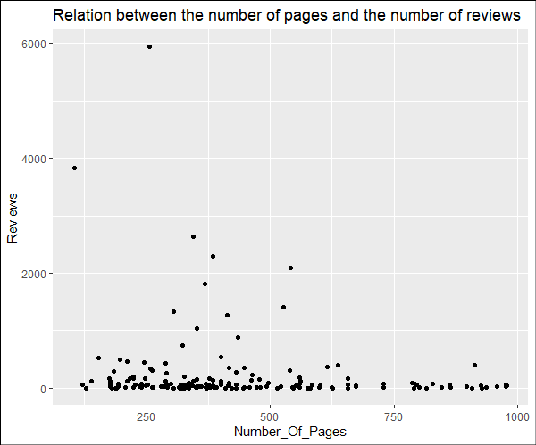

# R-Assignment 4

**Created by Ms.Nutnaree Seesawai (ID: 63130500030)**

Dataset: Top Computer Science / Programming Books (Data from Thomas Konstantin, [Kaggle](https://www.kaggle.com/thomaskonstantin/top-270-rated-computer-science-programing-books)) >> [CSV](https://raw.githubusercontent.com/safesit23/INT214-Statistics/main/datasets/prog_book.csv)


### Outlines
1. [Explore the dataset](#part-1--explore-the-dataset)
2. [Transform data and finding insight the data](#part-2--transform-data-and-finding-insight-the-data)
3. [Visualization with GGplot2](#part-3--visualization-with-ggplot2)

## Part 1 : Explore the dataset

```r
# Install a package for first time
install.packages("DescTools")
install.packages("assertive")
install.packages("magrittr")
install.packages("tidyverse")

# Import libraries
library(DescTools)
library(assertive)
library(magrittr)
library(tidyverse)

# Import Dataset
prog_books_org <- read.csv("https://raw.githubusercontent.com/safesit23/INT214-Statistics/main/datasets/prog_book.csv")

# Change to tibble new one to confirm, and seperate from original
top_prog_books <- as_tibble(prog_books_org)
```

### For observation the dataset
```r
glimpse(top_prog_books)
```
**Result:**
```
Rows: 271
Columns: 7
$ Rating          <dbl> 4.17, 4.01, 3.33, 3.97, 4.06, 3.84, 4.09, 4.15, 3.87, 4.62, 4.03, 3.78, 3.73, 3.87, 3.8~
$ Reviews         <chr> "3,829", "1,406", "0", "1,658", "1,325", "117", "5,938", "1,817", "2,093", "0", "160", ~
$ Book_title      <chr> "The Elements of Style", "The Information: A History, a Theory, a Flood", "Responsive W~
$ Description     <chr> "This style manual offers practical advice on improving writing skills. Throughout, the~
$ Number_Of_Pages <int> 105, 527, 50, 393, 305, 288, 256, 368, 259, 128, 352, 352, 200, 328, 240, 288, 392, 304~
$ Type            <chr> "Hardcover", "Hardcover", "Kindle Edition", "Hardcover", "Kindle Edition", "Paperback",~
$ Price           <dbl> 9.323529, 11.000000, 11.267647, 12.873529, 13.164706, 14.188235, 14.232353, 14.364706, ~
```

After obverse in this dataset, can see that there are 271 observations and 7 variables by 2 double variables (Rating,Price), 1 integer variable (Number_Of_Pages), 4 character variables (Reviews,Book_title,Description,Type). So, each variable can explain as below...

`Rating`: The user rating for the book. the rating score ranges between 0 and 5.\
`Reviews`: The number of reviews found on this book.\
`Book_title`: The name of the book.\
`Description`: a short description of the book.\
`Number_Of_Pages`: Number of pages in the book.\
`Type`: The type of the book meaning is it a hardcover book or an ebook or a kindle book etc.\
`Price`: The average price of the book in USD where the average is calculated according the 5 web sources.

That is incorrect with variables named `Reviews` which should be numeric and `Type` which should change to factor for any computing conveniently after. However, for 'Kindle Edition' type, like 'ebook' type which must read through Kindle, one of all Amazon Apps, also must move it into ebook type instead that seems one together with.

Then will have changed and shown in the part of `Transform data and finding insight the data` after this.

## Part 2 : Transform data and finding insight the data

### Check duplicate book title (with stringr functions)
```r
top_prog_books %>% duplicated() %>% sum() > 0
```
**Result:**
```
[1] FALSE
```
From checking, not found any duplicate book title in this data.

### Change data type

#### Reviews: character -> numeric 
```r
top_prog_books$Reviews <-
  top_prog_books$Reviews %>% str_trim() %>% str_squish() %>% str_remove(",") %>% as.numeric()
```
**Explanation:**\
`str_trim()` : removes whitespace from start and end of string then has uesd before change data type.\
`str_squish()` : reduces repeated whitespace inside a string then has uesd before change data type.\
`str_remove(pattern)` : remove matched patterns in a string as example above then has uesd before change data type.

#### Type: character -> factor
```r
top_prog_books <-
  top_prog_books %>% mutate(Type = as.factor(Type))
```
**Explanation:**
`mutate` : adds new variables and preserves existing ones.

### Write to CSV for keeping the changes before finding insight
```r
write_csv(top_prog_books, "top-prog-books-cleaned.csv")
```
### Summary
```r
summary(top_prog_books)
```
**Result:**
```
     Rating         Reviews        Book_title        Description       
 Min.   :3.000   Min.   :   0.0   Length:271         Length:271        
 1st Qu.:3.915   1st Qu.:   5.5   Class :character   Class :character  
 Median :4.100   Median :  35.0   Mode  :character   Mode  :character  
 Mean   :4.067   Mean   : 185.6                                        
 3rd Qu.:4.250   3rd Qu.: 116.5                                        
 Max.   :5.000   Max.   :5938.0                                        
 Number_Of_Pages                     Type         Price        
 Min.   :  50.0   Boxed Set - Hardcover:  1   Min.   :  9.324  
 1st Qu.: 289.0   ebook                :  7   1st Qu.: 30.751  
 Median : 384.0   Hardcover            : 95   Median : 46.318  
 Mean   : 475.1   Kindle Edition       : 10   Mean   : 54.542  
 3rd Qu.: 572.5   Paperback            :156   3rd Qu.: 67.854  
 Max.   :3168.0   Unknown Binding      :  2   Max.   :235.650  
```

### Finding insight the data

#### 1. What the Computer Science / Programming books which are the highest rating books ?
```r
# Seperate the highest rating books from all the data
highest_rating_books <- top_prog_books %>% filter(Rating == 5.00)
# To show the highest rating books and its data 
str_glue_data(highest_rating_books,
  "{Book_title}\nPrice: ${Price}\nType: {Type}\nThere is a description likes:\n{Description}")
```
**Result:**
```r
Your First App: Node.js
Price: $25.85588235
Type: ebook
There is a description likes:
A tutorial for real-world application development using Node.js, AngularJS, Express and MongoDB

Published via Leanpub, and can be found here: https://leanpub.com/yfa-nodejs

In this book, you will learn the basics of designing and developing a node.js application. Unlike other books, focus here is on learning multiple technologies at once and defining processes for success. T


...more
```
**Explanation:** Use `stringr` function named `str_glue_data` to link each value in a row to the long message be a string that's more convenient than open all its view when must read the summary or observe with small group data. From above, appears that 'Your First App: Node.js' is the Computer Science or Programming book which's the highest rating book without comparison about the number of reviews with others.


#### 2. What is the maximum and minimum price each book type ? 
```r
top_prog_books %>% group_by(Type) %>%
  summarise(max_price=max(Price),min_price=min(Price)) %>% 
  arrange(desc(max_price))
```
**Result:**
```
# A tibble: 6 x 3
  Type                  max_price min_price
  <fct>                     <dbl>     <dbl>
1 Hardcover                 236.       9.32
2 Boxed Set - Hardcover     220.     220.  
3 Paperback                 212.      14.2 
4 ebook                      83.2     25.9 
5 Kindle Edition             51.5     11.3 
6 Unknown Binding            38.3     36.1 
```
**Explanation:** 'Hardcover' is type of books what has both the maximum and minimum price. While 'Boxed Set - Hardcover' is less than a little bit from its maximum, and 'Kindle Edition' also is more than a little bit from its minimum.


#### 3. What is the maximum and minimum number of pages each book type ? 
```r
top_prog_books %>% group_by(Type) %>% 
  summarise(max_page=max(Number_Of_Pages),min_page=min(Number_Of_Pages)) %>% 
  arrange(desc(max_page))
```
**Result:**
```
# A tibble: 6 x 3
  Type                  max_page min_page
  <fct>                    <int>    <int>
1 Hardcover                 3168      105
2 Paperback                 1214      128
3 Boxed Set - Hardcover      896      896
4 ebook                      787      176
5 Kindle Edition             422       50
6 Unknown Binding            288      210
```
**Explanation:** 'Hardcover' is type of books what has the maximum number of pages, while 'Kindle Edition' also has the minimum.


#### 4. What is the top 10 books that have the highest rating without the number of reviews ? 
```r
head((top_prog_books %>% select(Book_title,Rating,Type) %>% arrange(desc(Rating))),10)
```
**Result:**
```
# A tibble: 10 x 3
   Book_title                                                        Rating Type    
   <chr>                                                              <dbl> <fct>   
 1 Your First App: Node.js                                             5    ebook   
 2 The Art of Computer Programming, Volumes 1-4a Boxed Set             4.77 Hardcov~
 3 Designing Data-Intensive Applications: The Big Ideas Behind Reli~   4.72 Paperba~
 4 Build Web Applications with Java: Learn every aspect to build we~   4.67 Paperba~
 5 Fluent Python: Clear, Concise, and Effective Programming            4.67 Paperba~
 6 ZX Spectrum Games Code Club: Twenty fun games to code and learn     4.62 Paperba~
 7 The Linux Programming Interface: A Linux and Unix System Program~   4.62 Hardcov~
 8 CLR via C# (Developer Reference)                                    4.58 Paperba~
 9 The Elements of Computing Systems: Building a Modern Computer fr~   4.54 Hardcov~
10 Practical Object Oriented Design in Ruby                            4.54 Paperba~
```
**Explanation:** The top 10 books that have the highest rating without computing the number of reviews, most type are 'Paperback', 'Hardcover', and 'ebook' respectively.


#### 5. What is the top 10 books that have the highest reviews together with the number of rating and its price ? 
```r
head((top_prog_books %>% select(Book_title,Rating,Reviews,Price,Type) %>% 
    arrange(desc(Reviews),desc(Rating))),10)
```
**Result:**
```
# A tibble: 10 x 5
   Book_title                                                 Rating Reviews Price Type      
   <chr>                                                       <dbl>   <dbl> <dbl> <fct>     
 1 Start with Why: How Great Leaders Inspire Everyone to Tak~   4.09    5938 14.2  Hardcover 
 2 The Elements of Style                                        4.17    3829  9.32 Hardcover 
 3 The Phoenix Project: A Novel About IT, DevOps, and Helpin~   4.27    2629 24.3  Hardcover 
 4 The Goal: A Process of Ongoing Improvement                   4.05    2290 37.1  Paperback 
 5 Weapons of Math Destruction: How Big Data Increases Inequ~   3.87    2093 14.5  Hardcover 
 6 The Innovators: How a Group of Hackers, Geniuses and Geek~   4.1     2092 17.2  Hardcover 
 7 Algorithms to Live By: The Computer Science of Human Deci~   4.15    1817 14.4  Hardcover 
 8 Ghost in the Wires: My Adventures as the World's Most Wan~   3.97    1658 12.9  Hardcover 
 9 The Information: A History, a Theory, a Flood                4.01    1406 11    Hardcover 
10 How Google Works                                             4.06    1325 13.2  Kindle Ed~
```
**Explanation:** The top 10 books that have the highest reviews together with the number of rating and its price, most type are 'Hardcover' and rate of its price is less than 40 approximately.


#### 6. What is the top 10 books that are the most expensive books together with the number of reviews and rating ? 
```r
head((top_prog_books %>% select(Book_title,Rating,Reviews,Price,Type) %>% 
    arrange(desc(Price),desc(Reviews),desc(Rating))),10)
```
**Result:**
```
# A tibble: 10 x 5
   Book_title                                              Rating Reviews Price Type         
   <chr>                                                    <dbl>   <dbl> <dbl> <fct>        
 1 A Discipline for Software Engineering                     3.84       5  236. Hardcover    
 2 The Art of Computer Programming, Volumes 1-3 Boxed Set    4.49      36  220. Boxed Set - ~
 3 The Art of Computer Programming, Volumes 1-4a Boxed Set   4.77       4  220. Hardcover    
 4 An Introduction to Database Systems                       3.94      22  212. Paperback    
 5 3D Game Engine Architecture: Engineering Real-Time App~   3.76       0  203. Hardcover    
 6 Numerical Recipes: The Art of Scientific Computing        4.26       5  176. Hardcover    
 7 Game Programming Gems 3                                   3.82       0  143. Hardcover    
 8 Game Programming Gems 4                                   3.77       0  139. Hardcover    
 9 Compilers: Principles, Techniques, and Tools              4.08      56  127. Hardcover    
10 Game Programming Gems 6                                   3.82       0  119. Hardcover   
```
**Explanation:** The top 10 books that are the most expensive books together with the number of reviews and rating, most type are 'Hardcover' and the number of its reviews is not over 60 approximately.


#### 7. What is the top 10 books that are the cheapest together with the number of reviews and rating ? 
```r
head((top_prog_books %>% select(Book_title,Rating,Reviews,Price,Type) %>% 
    arrange(Price,desc(Reviews),desc(Rating))),10)
```
**Result:**
```
# A tibble: 10 x 5
   Book_title                                                 Rating Reviews Price Type      
   <chr>                                                       <dbl>   <dbl> <dbl> <fct>     
 1 The Elements of Style                                        4.17    3829  9.32 Hardcover 
 2 The Information: A History, a Theory, a Flood                4.01    1406 11    Hardcover 
 3 Responsive Web Design Overview For Beginners                 3.33       0 11.3  Kindle Ed~
 4 Ghost in the Wires: My Adventures as the World's Most Wan~   3.97    1658 12.9  Hardcover 
 5 How Google Works                                             4.06    1325 13.2  Kindle Ed~
 6 The Meme Machine                                             3.84     117 14.2  Paperback 
 7 Start with Why: How Great Leaders Inspire Everyone to Tak~   4.09    5938 14.2  Hardcover 
 8 Algorithms to Live By: The Computer Science of Human Deci~   4.15    1817 14.4  Hardcover 
 9 Weapons of Math Destruction: How Big Data Increases Inequ~   3.87    2093 14.5  Hardcover 
10 ZX Spectrum Games Code Club: Twenty fun games to code and~   4.62       0 14.6  Paperback 
```
**Explanation:** The top 10 books that are the cheapest together with the number of reviews and rating, most type are 'Hardcover' again but most number of reviews each books are more than 1200.


## Part 3 : Visualization with GGplot2
### 1.) Graph show a relation in the group of books which rating are equal to or more than 4 and number of pages are less then 1000 between the number of pages and the number of reviews.
```r
top_books_rating_4to5 <- top_prog_books %>% 
  filter(Rating >= 4 & Number_Of_Pages < 1000) %>% arrange(desc(Rating))
num_pages_reviews_plot <- ggplot(top_books_rating_4to5,aes(y=Reviews,x=Number_Of_Pages))
num_pages_reviews_plot+geom_jitter()+ggtitle("Relation between the number of pages and the number of reviews")
```
Result:


### 2.) Graph show the number of pages each book by separating `Type` with colors.
```r
num_pages_each_book_plot <-
  ggplot(top_prog_books,aes(x=Book_title,y=Number_Of_Pages))+geom_point(aes(color=Type))
num_pages_each_book_plot+ggtitle("The number of pages each book by separating type")+ylab("The Number of Pages")+xlab("Book Names")
```
Result:

