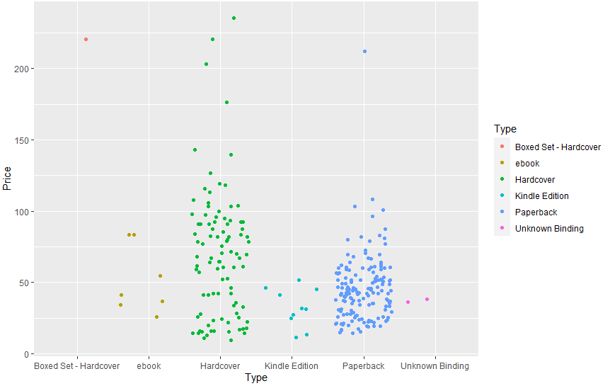
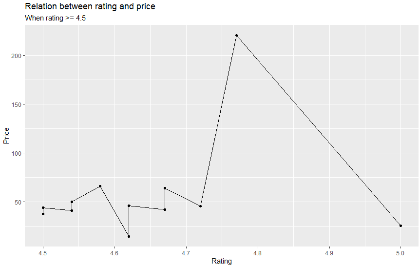

# R-Assignment 4

**Created by Nutchanon Assawachin (ID: 63130500032)**

Choose Dataset:

Top 270 Computer Science / Programing Books (Data from Thomas Konstantin, [Kaggle](https://www.kaggle.com/thomaskonstantin/top-270-rated-computer-science-programing-books)) >> [Using CSV](https://raw.githubusercontent.com/safesit23/INT214-Statistics/main/datasets/prog_book.csv)

### Outlines

1. Explore the dataset
2. Learning function from Tidyverse
3. Transform data with dplyr and finding insight the data
4. Visualization with GGplot2

## Part 1: Explore the dataset

```r
# Library
library(dplyr)
library(readr)
library(stringr)
library(ggplot2)

# Dataset
prog_book <- read.csv('https://raw.githubusercontent.com/safesit23/INT214-Statistics/main/datasets/prog_book.csv')

#observation the dataset
glimpse(prog_book)
```

In this dataset has

```
Rows: 271
Columns: 7
$ Rating          <dbl> 4.17, 4.01, 3.33, 3.97, 4.06, 3.84, 4.09, 4.15, 3.87, 4.62, 4.03, 3.78, 3~
$ Reviews         <dbl> 3829, 1406, 0, 1658, 1325, 117, 5938, 1817, 2093, 0, 160, 481, 33, 1255, ~
$ Book_title      <chr> "The Elements of Style", "The Information: A History, a Theory, a Flood",~
$ Description     <chr> "This style manual offers practical advice on improving writing skills. T~
$ Number_Of_Pages <int> 105, 527, 50, 393, 305, 288, 256, 368, 259, 128, 352, 352, 200, 328, 240,~
$ Type            <chr> "Hardcover", "Hardcover", "Kindle Edition", "Hardcover", "Kindle Edition"~
$ Price           <dbl> 9.323529, 11.000000, 11.267647, 12.873529, 13.164706, 14.188235, 14.23235~
```

1. Rating `numeric` คะแนนของหนังสือ
2. Reviews `character` จำนวนรีวิวของหนังสือ
3. Book_title `character` ชื่อหนังสือ
4. Description `character` คำอธิบายหนังสือ
5. Number_of_Pages `numeric` จำนวนหน้าของหนังสือ
6. Type `character` ประเภทหนังสือ
7. Price `numeric` ราคาหนังสือ

### Cleaning

Check duplicate

```r
prog_book %>% duplicated() %>% sum()
```

ไม่มีของหนังสือที่ซ้ำกัน

Check NA

```r
prog_book %>% is.na() %>% sum()
```

ไม่มีค่า NA

## Part 2 & Part 3 : Learning function from Tidyverse & Transform data with dplyr and finding insight the data

- Function `select()` from package [dplyr](https://dplyr.tidyverse.org/articles/dplyr.html#select-columns-with-select). It using for select columns
- Function `filter()` from package [dplyr](https://dplyr.tidyverse.org/reference/filter.html). Allows you to select a subset of rows in a data frame
- Function `arrange()` from package[dplyr](https://dplyr.tidyverse.org/reference/arrange.html). Orders the rows of a data frame by the values of selected columns
- Function `count()` from package[dplyr](https://dplyr.tidyverse.org/reference/count.html). Lets you quickly count the unique values of one or more variables
- Function `stringr()` from package[stringr](https://stringr.tidyverse.org/reference/str_detect.html). Tells you if there’s any match to the pattern

### 1.หาหนังสือที่มีราคาถูกที่สุด 10 อันดับ

```r
prog_book %>% filter(Price >= min(Price)) %>% select(Book_title,Price) %>% head(10)
```

Result

```
                                                                               Book_title     Price
1                                                                   The Elements of Style  9.323529
2                                           The Information: A History, a Theory, a Flood 11.000000
3                                            Responsive Web Design Overview For Beginners 11.267647
4                     Ghost in the Wires: My Adventures as the World's Most Wanted Hacker 12.873529
5                                                                        How Google Works 13.164706
6                                                                        The Meme Machine 14.188235
7                       Start with Why: How Great Leaders Inspire Everyone to Take Action 14.232353
8                          Algorithms to Live By: The Computer Science of Human Decisions 14.364706
9  Weapons of Math Destruction: How Big Data Increases Inequality and Threatens Democracy 14.502941
10                        ZX Spectrum Games Code Club: Twenty fun games to code and learn 14.641176
```

### 2.หาจำนวนหนังสือในแต่ละประเภท

```r
prog_book %>% count(Type) %>% arrange(desc(n))
```

Result

```
                   Type   n
1             Paperback 156
2             Hardcover  95
3        Kindle Edition  10
4                 ebook   7
5       Unknown Binding   2
6 Boxed Set - Hardcover   1
```

### 3.หาชื่อหนังสือที่มีคำว่า Hackers

```r
prog_book %>% filter(str_detect(Book_title, "Hackers")) %>% select(Book_title)
```

Result

```
                                                                                 Book_title
1 The Innovators: How a Group of Hackers, Geniuses and Geeks Created the Digital Revolution
2                                                              Machine Learning for Hackers
```

### 4.หาว่าหนังสือแต่ละประเภทมีหน้าเฉลี่ยกี่หน้า

```r
prog_book %>% group_by(Type) %>% summarise(avg_page = mean(Number_Of_Pages))
```

Result

```
  Type                  avg_page
  <chr>                    <dbl>
1 Boxed Set - Hardcover     896
2 ebook                     386
3 Hardcover                 614.
4 Kindle Edition            283.
5 Paperback                 407.
6 Unknown Binding           249
```

### 5.หาหนังสือที่มี Rating ดีที่สุด

```r
prog_book %>% filter(Rating == max(Rating)) %>% select(Book_title,Rating)
```

Result

```
               Book_title Rating
1 Your First App: Node.js      5
```

## Part 4: Visualization with GGplot2

### 1.กราฟแสดงราคาของหนังสือแต่ละประเภท

```r
prog_book %>% ggplot(aes(x = Type ,y = Price, colour= Type)) + geom_jitter()
```

Result:



### 2.กราฟแสดงความสัมพันธ์ของเรทติ้งและราคาของหนังสือที่มีเรทติ้งมากกว่าหรือ

```r
prog_book %>% filter(Rating >= 4.5) %>% ggplot(aes(x = Rating ,y = Price)) + geom_line() + geom_point() + ggtitle("Relation between rating and price","When rating >= 4.5")
```

Result:


