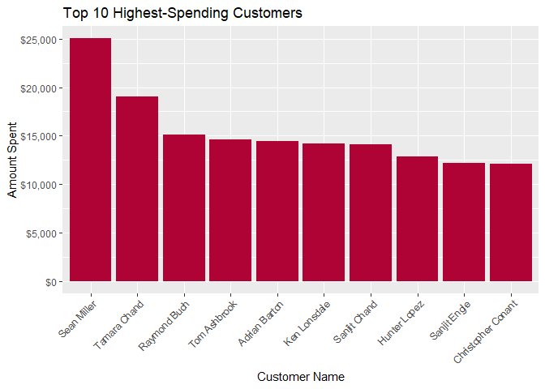
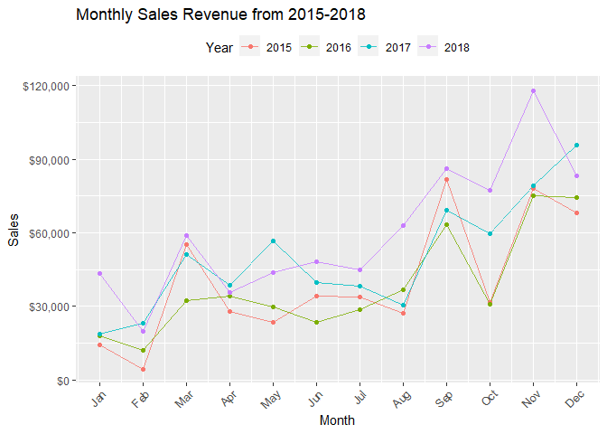

HW04
================
63130500041 Tawan Muadmuenwai

# Contents

1.  [Define the questions](#define-the-questions)
2.  [Explore the dataset](#explore-the-dataset)
3.  [Data Transformation and Data
    Cleaning](#data-transformation-and-data-cleaning)
4.  [Exploratory Data Analysis](#exploratory-data-analysis)
5.  [Data Visualization](#data-visualization)
6.  [Functions not taught in the
    class](#functions-not-taught-in-the-class)

# Define the questions

1.  What are the top ten most revenue-generating sub-categories?
2.  What are the top ten most ordered products in 2017?
3.  What are the average time to ship in each year?
4.  What are the top ten states with the highest number of customers?
5.  What are the top ten highest-spending customers?
6.  Is the sales increasing or decreasing over time?

# Explore the dataset

## Import libraries

``` r
library(tidyverse)
library(lubridate)
library(ggplot2)
```

## Import the dataset

``` r
superstore <-
  read_csv("https://raw.githubusercontent.com/safesit23/INT214-Statistics/main/datasets/superstore_sales.csv")
```

## Explore the dataset

``` r
glimpse(superstore)
```

    ## Rows: 9,800
    ## Columns: 18
    ## $ `Row ID`        <dbl> 1, 2, 3, 4, 5, 6, 7, 8, 9, 10, 11, 12, 13, 14, 15, 16,~
    ## $ `Order ID`      <chr> "CA-2017-152156", "CA-2017-152156", "CA-2017-138688", ~
    ## $ `Order Date`    <chr> "08/11/2017", "08/11/2017", "12/06/2017", "11/10/2016"~
    ## $ `Ship Date`     <chr> "11/11/2017", "11/11/2017", "16/06/2017", "18/10/2016"~
    ## $ `Ship Mode`     <chr> "Second Class", "Second Class", "Second Class", "Stand~
    ## $ `Customer ID`   <chr> "CG-12520", "CG-12520", "DV-13045", "SO-20335", "SO-20~
    ## $ `Customer Name` <chr> "Claire Gute", "Claire Gute", "Darrin Van Huff", "Sean~
    ## $ Segment         <chr> "Consumer", "Consumer", "Corporate", "Consumer", "Cons~
    ## $ Country         <chr> "United States", "United States", "United States", "Un~
    ## $ City            <chr> "Henderson", "Henderson", "Los Angeles", "Fort Lauderd~
    ## $ State           <chr> "Kentucky", "Kentucky", "California", "Florida", "Flor~
    ## $ `Postal Code`   <dbl> 42420, 42420, 90036, 33311, 33311, 90032, 90032, 90032~
    ## $ Region          <chr> "South", "South", "West", "South", "South", "West", "W~
    ## $ `Product ID`    <chr> "FUR-BO-10001798", "FUR-CH-10000454", "OFF-LA-10000240~
    ## $ Category        <chr> "Furniture", "Furniture", "Office Supplies", "Furnitur~
    ## $ `Sub-Category`  <chr> "Bookcases", "Chairs", "Labels", "Tables", "Storage", ~
    ## $ `Product Name`  <chr> "Bush Somerset Collection Bookcase", "Hon Deluxe Fabri~
    ## $ Sales           <dbl> 261.9600, 731.9400, 14.6200, 957.5775, 22.3680, 48.860~

This dataset has 9800 observations and 18 variables. Each one of them is
self-explanatory.

-   Row ID is a `numeric` variable.
-   Order ID is a `character` variable.
-   Order Date is a `character` variable.
-   Ship Date is a `character` variable.
-   Ship Mode is a `character` variable.
-   Customer ID is a `character` variable.
-   Customer Name is a `character` variable.
-   Segment is a `character` variable.
-   Country is a `character` variable.
-   City is a `character` variable.
-   State is a `character` variable.
-   Postal Code is a `numeric` variable.
-   Region is a `character` variable.
-   Product ID is a `character` variable.
-   Category is a `character` variable.
-   Sub-Category is a `character` variable.
-   Product Name is a `character` variable.
-   Sales is a `numeric` variable.

### What should be done?

-   Order Date and Ship Date should be converted to date objects.
-   Ship Mode, Customer ID, Segment, Country, City, State, Postal Code,
    Region, Product ID, Category, Sub-Category should be converted to
    factor variables.

# Data Transformation and Data Cleaning

## 1. Convert the date-formatted columns to date objects

``` r
superstore <-
  superstore %>%
  mutate(`Order Date` = as_date(`Order Date`, format = "%d/%m/%Y")) %>%
  mutate(`Ship Date` = as_date(`Ship Date`, format = "%d/%m/%Y"))
```

## 2. Convert categorical columns to factors

``` r
superstore <-
  superstore %>%
    mutate(
      across(c(`Ship Mode`, `Customer ID`, Segment, Country, City, State, `Postal Code`, Region, `Product ID`, Category, `Sub-Category`), factor))
```

# Exploratory Data Analysis

## 1. What are the top ten most revenue-generating sub-categories?

``` r
superstore %>%
  group_by(`Sub-Category`) %>%
  summarise(
    Sales = sum(`Sales`)) %>%
  arrange(desc(Sales)) %>%
  head(10)
```

    ## # A tibble: 10 x 2
    ##    `Sub-Category`   Sales
    ##    <fct>            <dbl>
    ##  1 Phones         327782.
    ##  2 Chairs         322823.
    ##  3 Storage        219343.
    ##  4 Tables         202811.
    ##  5 Binders        200029.
    ##  6 Machines       189239.
    ##  7 Accessories    164187.
    ##  8 Copiers        146248.
    ##  9 Bookcases      113813.
    ## 10 Appliances     104618.

**Summary**

The top ten most revenue-generating sub-categories are:

-   Phones with a total sales of $327,782
-   Chairs with a total sales of $322,823
-   Storage with a total sales of $219,343
-   Tables with a total sales of $202,811
-   Binders with a total sales of $200,029
-   Machines with a total sales of $189,239
-   Accessories with a total sales of $164,187
-   Copiers with a total sales of $146,248
-   Bookcases with a total sales of $113,813
-   Appliances with a total sales of $104,618

## 2. What are the top ten most ordered products in 2017?

``` r
superstore %>%
  filter(year(`Order Date`) == 2017) %>%
  group_by(`Product Name`) %>%
  summarise(OrderCount = n()) %>%
  arrange(desc(OrderCount)) %>%
  head(10)
```

    ## # A tibble: 10 x 2
    ##    `Product Name`                                                OrderCount
    ##    <chr>                                                              <int>
    ##  1 "Staple envelope"                                                     11
    ##  2 "Easy-staple paper"                                                   10
    ##  3 "Chromcraft Round Conference Tables"                                   9
    ##  4 "Staples"                                                              9
    ##  5 "XtraLife ClearVue Slant-D Ring Binder, White, 3\""                    7
    ##  6 "Acco Perma 4000 Stacking Storage Drawers"                             6
    ##  7 "Avery Non-Stick Binders"                                              6
    ##  8 "Hon Deluxe Fabric Upholstered Stacking Chairs, Rounded Back"          6
    ##  9 "Ibico EB-19 Dual Function Manual Binding System"                      6
    ## 10 "Premium Transparent Presentation Covers by GBC"                       6

**Summary**

The top ten most ordered product in 2017 are:

-   “Staple envelope” with a total order count of 11
-   “Easy-staple paper” with a total order count of 10
-   “Chromcraft Round Conference Tables” with a total order count of 9
-   “Staples” with a total order count of 9
-   “XtraLife ClearVue Slant-D Ring Binder, White, 3"” with a total
    order count of 7
-   “Acco Perma 4000 Stacking Storage Drawers” with a total order count
    of 6
-   “Avery Non-Stick Binders” with a total order count of 6
-   “Hon Deluxe Fabric Upholstered Stacking Chairs, Rounded Back” with a
    total order count of 6
-   “Ibico EB-19 Dual Function Manual Binding System” with a total order
    count of 6
-   “Premium Transparent Presentation Covers by GBC” with a total order
    count of 6

## 3. What are the average time to ship in each year?

``` r
superstore %>%
  mutate(Year = year(`Ship Date`)) %>%
  mutate(DaysToShip = `Ship Date` - `Order Date`) %>%
  group_by(Year) %>%
  summarise(
    AverageDaysToShip = mean(`DaysToShip`) %>% round(2)) %>%
  arrange(Year)
```

    ## # A tibble: 5 x 2
    ##    Year AverageDaysToShip
    ##   <dbl> <drtn>           
    ## 1  2015 3.98 days        
    ## 2  2016 4.04 days        
    ## 3  2017 3.93 days        
    ## 4  2018 3.91 days        
    ## 5  2019 4.93 days

**Summary**

The average time to ship in each year are:

-   2015 with an average time to ship of 3.98 days
-   2016 with an average time to ship of 4.04 days
-   2017 with an average time to ship of 3.93 days
-   2018 with an average time to ship of 3.91 days
-   2019 with an average time to ship of 4.93 days

## 4. What are the top ten states with the highest number of customers?

``` r
superstore %>%
  group_by(State) %>%
  distinct(`Customer ID`) %>%
  summarise(
    CustomerCount = n()) %>%
  arrange(desc(CustomerCount)) %>%
  head(10)
```

    ## # A tibble: 10 x 2
    ##    State          CustomerCount
    ##    <fct>                  <int>
    ##  1 California               570
    ##  2 New York                 409
    ##  3 Texas                    367
    ##  4 Pennsylvania             255
    ##  5 Illinois                 231
    ##  6 Washington               223
    ##  7 Ohio                     196
    ##  8 Florida                  178
    ##  9 North Carolina           120
    ## 10 Virginia                 107

**Summary**

The top ten states with the highest number of customers are:

-   California with a total customer count of 570
-   New York with a total customer count of 409
-   Texas with a total customer count of 367
-   Pennsylvania with a total customer count of 255
-   Illinois with a total customer count of 231
-   Washington with a total customer count of 223
-   Ohio with a total customer count of 196
-   Florida with a total customer count of 178
-   North Carolina with a total customer count of 120
-   Virginia with a total customer count of 107

## 5. What are the top ten highest-spending customers?

``` r
superstore %>%
  group_by(`Customer ID`) %>%
  mutate(
    AmountSpent = sum(Sales)) %>%
  distinct(`Customer ID`, `Customer Name`, AmountSpent) %>%
  arrange(desc(AmountSpent)) %>%
  head(10)
```

    ## # A tibble: 10 x 3
    ## # Groups:   Customer ID [10]
    ##    `Customer ID` `Customer Name`    AmountSpent
    ##    <fct>         <chr>                    <dbl>
    ##  1 SM-20320      Sean Miller             25043.
    ##  2 TC-20980      Tamara Chand            19052.
    ##  3 RB-19360      Raymond Buch            15117.
    ##  4 TA-21385      Tom Ashbrook            14596.
    ##  5 AB-10105      Adrian Barton           14474.
    ##  6 KL-16645      Ken Lonsdale            14175.
    ##  7 SC-20095      Sanjit Chand            14142.
    ##  8 HL-15040      Hunter Lopez            12873.
    ##  9 SE-20110      Sanjit Engle            12209.
    ## 10 CC-12370      Christopher Conant      12129.

**Summary**

The top ten highest-spending customer are:

-   Sean Miller with a total amount spent of $25,043
-   Tamara Chand with a total amount spent of $19,052
-   Raymond Buch with a total amount spent of $15,117
-   Tom Ashbowl with a total amount spent of $14,596
-   Adrian Barton with a total amount spent of $14,474
-   Ken Lonsdale with a total amount spent of $14,175
-   Sanjit Chand with a total amount spent of $14,142
-   Hunter Lopez with a total amount spent of $12,873
-   Sanjit Engle with a total amount spent of $12,209
-   Christopher Conant with a total amount spent of $12,129

## 6. Is the sales increasing or decreasing over time?

``` r
sales_by_year <-
  superstore %>%
  mutate(
    Year = year(`Order Date`)) %>%
  group_by(Year) %>%
  summarise(
    Sales = sum(Sales)) %>%
  arrange(Year)

cor(sales_by_year$Year, sales_by_year$Sales)
```

    ## [1] 0.9214924

**Summary**

The sales are increasing over time because the years and sales have a
strong positive correlation.

# Data Visualization

## 1. What are the top ten highest-spending customers?

``` r
superstore %>%
  group_by(`Customer ID`) %>%
  mutate(
    AmountSpent = sum(Sales)) %>%
  distinct(`Customer ID`, `Customer Name`, AmountSpent) %>%
  arrange(desc(AmountSpent)) %>%
  head(10) %>%
  ggplot(aes(x = reorder(`Customer Name`, -AmountSpent), y = AmountSpent)) +
    geom_col(fill = "#b00335") +
    scale_y_continuous(labels = scales::dollar_format()) +
    labs(x = "Customer Name", y = "Amount Spent", title = "Top 10 Highest-Spending Customers") +
    theme(axis.text.x = element_text(angle = 45, hjust = 1))
```

<!-- -->

**Summary**

The sales drop for a bit in 2016 but then go back up tremendously in
2017, continuing to go up in 2018, which means that overall, the sales
are increasing over time.

## 2. What are the sales trends for each month of each year?

``` r
sales_by_month <- superstore %>%
  mutate(
    Year = year(`Order Date`),
    Month = month(`Order Date`)) %>%
  group_by(Year, Month) %>%
  summarise(
    Sales = sum(Sales)) %>%
  arrange(Year, Month)
```

``` r
sales_by_month %>%
  ggplot(aes(x = Month, y = Sales, color = as.factor(Year))) +
    geom_line(alpha = 0.8) +
    geom_point() +
    labs(color = "Year", title = "Monthly Sales Revenue from 2015-2018") +
    scale_y_continuous(labels = scales::dollar_format()) +
    scale_x_continuous(labels = c(month.abb[1:12]), breaks = c(1:12)) +
    theme(
      axis.text.x = element_text(angle = 45, hjust = 1),
      legend.position = "top")
```

<!-- -->

**Summary**

In 2015, the sales started off with a relatively low amount of sales,
but then increased dramatically in March and dropped again in April. The
sales increased dramatically in September and then dropped again in
October, followed by a strong increase in November and dipped for a bit
in December.

2016 is similar to 2015, but the changes in sales are less dramatic.

In 2017, the sales started off lower than in 2016, but then increased
dramatically in March and gradually dropped for a bit in August. The
sales increased dramatically in September and kept increasing to the end
of the year.

2018 started off with highest sales among 4 years, but then dropped
dramatically in Feburary. The sales went through the same pattern as in
2017, but the changes are more dramatic and hit the peak amount of sales
per one month in November.

Overall, each year starts off with a low sales amount, but then
gradually increases in March, occasionally drops and then increases
again between Q2 and Q3, ending with a peak amount of sales in Q4.

# Functions not taught in the class

## 1. `as_date()`

Convert date-formatted text to a date. A drop-in replacement for
`as.Date()`.

### Example

``` r
"27/05/2042" %>% as_date(format = "%d/%m/%Y")
```

    ## [1] "2042-05-27"

## 2. `year()`

Extracts the year from a date.

### Example

``` r
"27/05/2042" %>% as_date(format = "%d/%m/%Y") %>% year()
```

    ## [1] 2042

## 3. `month()`

Extracts the month from a date.

### Example

``` r
"27/05/2042" %>% as_date(format = "%d/%m/%Y") %>% month()
```

    ## [1] 5

## 4. `across()`

Used to apply a function across multiple columns. Can be used inside
`mutate()`.

### Example

``` r
data <- data.frame(
  Id = 1:10,
  Letter = LETTERS[1:10])

data %>% glimpse()
```

    ## Rows: 10
    ## Columns: 2
    ## $ Id     <int> 1, 2, 3, 4, 5, 6, 7, 8, 9, 10
    ## $ Letter <chr> "A", "B", "C", "D", "E", "F", "G", "H", "I", "J"

Supposed we want to convert both columns Id (`numeric`) and Letter
(`character`) to `factor`

``` r
data %>%
  mutate(
    across(c(Id, Letter), factor)) %>%
  glimpse()
```

    ## Rows: 10
    ## Columns: 2
    ## $ Id     <fct> 1, 2, 3, 4, 5, 6, 7, 8, 9, 10
    ## $ Letter <fct> A, B, C, D, E, F, G, H, I, J
