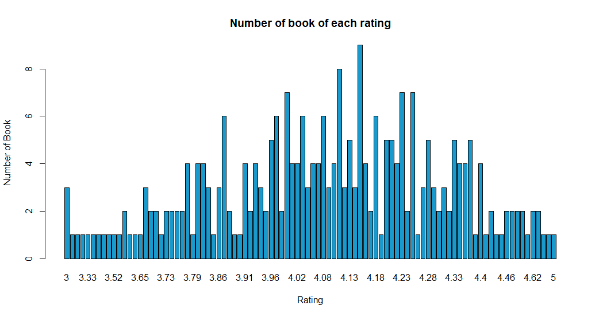
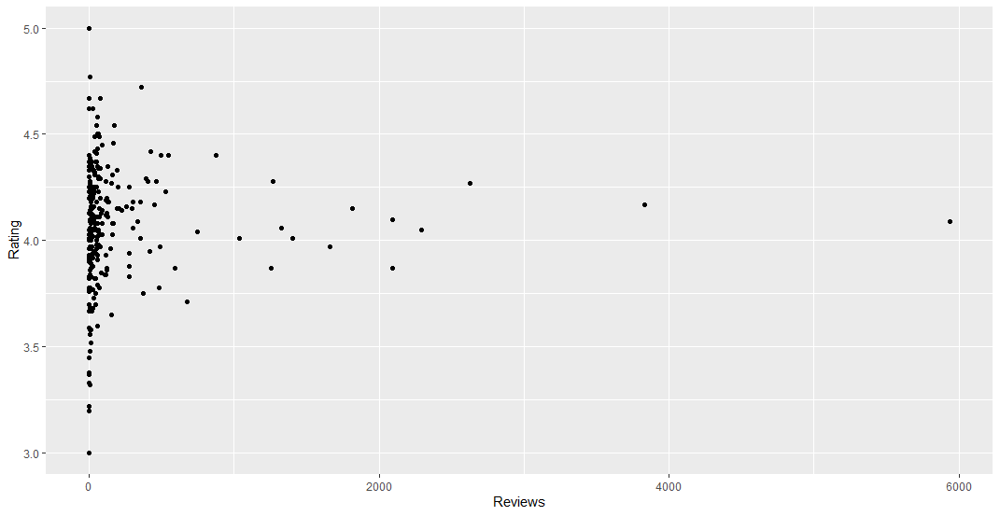

# R-Assignment 4

**Created by Tharadon Saenmart (ID: 63130500054)**

Choose Dataset: Superstore Sales Dataset (Data from Rohit Sahoo, [Kaggle](https://www.kaggle.com/rohitsahoo/sales-forecasting)) >> [Using CSV](https://raw.githubusercontent.com/safesit23/INT214-Statistics/main/datasets/superstore_sales.csv)


### Outlines
1. Explore the dataset
2. Learning function from Tidyverse
3. Transform data with dplyr and finding insight the data
4. Visualization with GGplot2

## Part 1: Explore the dataset

```r
# Libraries
library(dplyr)
library(readr)
library(stringr)
library(ggplot2)

# Import dataset
progBooks <- read.csv('https://raw.githubusercontent.com/safesit23/INT214-Statistics/main/datasets/prog_book.csv')
```

####Inspected Data
```r
Rows: 271
Columns: 7
$ Rating          <dbl> 4.17, 4.01, 3.33, 3.97, 4.06, 3.84, 4.09, 4.15, 3.87, 4.62, 4.03, 3.78, 3.73, 3.87, 3.8~
$ Reviews         <chr> "3,829", "1,406", "0", "1,658", "1,325", "117", "5,938", "1,817", "2,093", "0", "160", ~
$ Book_title      <chr> "The Elements of Style", "The Information: A History, a Theory, a Flood", "Responsive W~
$ Description     <chr> "This style manual offers practical advice on improving writing skills. Throughout, the~
$ Number_Of_Pages <int> 105, 527, 50, 393, 305, 288, 256, 368, 259, 128, 352, 352, 200, 328, 240, 288, 392, 304~
$ Type            <chr> "Hardcover", "Hardcover", "Kindle Edition", "Hardcover", "Kindle Edition", "Paperback",~
$ Price           <dbl> 9.323529, 11.000000, 11.267647, 12.873529, 13.164706, 14.188235, 14.232353, 14.364706, ~
```

- `Rating` represent rating of the book as `Numeric` variable.
- `Reviews` represent number of the book's reviewing as `Character` variable.
- `Book_title` represent name of the book as `Character` variable.
- `Description` represent the book description as `Character variable.
- `Number_Of_Pages` represent number of page of the book as `Numeric` variable.
- `Type` represent type of each book as `Character` variable.
- `Price` represent price of each book as `Numeric` variable.

## Part 2: Learning function from Tidyverse

- Function `str_detect()` from package [stringr](https://stringr.tidyverse.org/). It using for string detection

```
# Learning function `str_detect` from Tidyverse (stringr)
progBooks %>% filter(str_detect(progBooks$Book_title, "JavaScript")) %>% select(Book_title)
```
From the example, we have `JavaScript` as a keyword and we use str_detect to detect the book title that included `JavaScript` and then we use `filter` function to filter out the data and use `select` function to select column that we want to look up.

## Part 3: Transform data with dplyr and finding insight the data

### Data issue
- Data type of `Reviews` should be `Numeric` without commas. 

### Data cleaning
Convert data type of `Reviews` from `Character` to `Numberic`
```r
# Convert `Review` column from `Character` to `Numeric`.
progBooks <- progBooks %>% mutate(Reviews = as.integer(str_remove(Reviews, ",")))


# Inspect `Review` column.
glimpse(progBooks$Reviews)
```
- Use `str_remove` to remove expect string. In this case is ","
- Use `as.interger` to convert data type to `Numeric` in `Integer` format.
- Assign converted value to `Reviews`.
- Use mutate to update `Reviews` column.
- Assign all updated `Reviews` column to dataset variable.

### 1.The books that have book price more than 210.

```r
progBooks %>% filter(Price > 210) %>% select(Book_title, Price)
```

Result:
```
                                                Book_title     Price
1                        An Introduction to Database Systems   212.0971
2     The Art of Computer Programming, Volumes 1-3 Boxed Set   220.3853
3    The Art of Computer Programming, Volumes 1-4a Boxed Set   220.3853
4                      A Discipline for Software Engineering   235.6500
```

### 2.The books that have book title keyword "Mathematics".

```r
progBooks %>% filter(str_detect(progBooks$Book_title, "Mathematics")) %>% select(Book_title)
```

Result:
```
                                                    Book_title
1            Does God Play Dice?: The New Mathematics of Chaos
2                      From Mathematics to Generic Programming
3    Mathematics for 3D Game Programming and Computer Graphics
4      Concrete Mathematics: A Foundation for Computer Science
5 Essential Mathematics for Games and Interactive Applications
```

### 3.Top 5 books that have book reviews more that reviews average ordered by Review descending.

```r
progBooks %>% filter(Reviews > mean(Reviews)) %>% 
              head(5) %>% 
              select(Book_title, Reviews) %>%
              arrange(desc(Reviews))

```

Result:
```
                                                           Book_title   Reviews
1   Start with Why: How Great Leaders Inspire Everyone to Take Action    5938
2                                               The Elements of Style    3829
3 Ghost in the Wires: My Adventures as the World's Most Wanted Hacker    1658
4                       The Information: A History, a Theory, a Flood    1406
5                                                    How Google Works    1325
```

### 4.The books that have description word length less that 100.

```r
progBooks %>% filter(str_count(Description) < 100) %>% 
              mutate(DescWordLength = str_count(Description))  %>% 
              select(Book_title, DescWordLength) %>%
              arrange(DescWordLength)
```

Result:
```
                                            Book_title    DescWordLength
1                           The Algorithm Design Manual             24
2 Functional Programming Application and Implementation             63
3       Practical Foundations for Programming Languages             94
```

### 5.The book that has maximum rating.

```r
progBooks %>% filter(Rating >= max(Rating)) %>% select(Book_title, Rating)
```

Result:
```
                    Book_title Rating
1 Your First App: Node.js      5
```

### 6.Does number of page affected to the book rating.

```r
cor(progBooks$Number_Of_Pages, progBooks$Rating)
```

Result:
```
0.1321888
```

Sumary
Number of page is quite affective to the book rating because, the result of correlation function is `0.1321888`

## Part 4: Visualization with GGplot2
### 1.) Graph show number of book of each rating
```r
scat_plot <- starwars %>% filter(mass<500) %>% ggplot(aes(x=height,y=mass))+
  geom_point(aes(color=gender))
scat_plot+geom_smooth()
```
Result:


### 2.) Graph show relationship between Review and Rating
```r
ggplot(
  progBooks,
  aes(x = Reviews, y = Rating)
) + geom_point()
```
Result:
