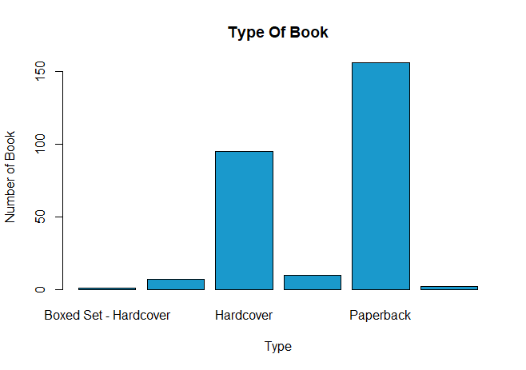

# R-Assignment 4

**Created by Chinnawat Kaewnongsang (ID: 63130500022)**

Choose Dataset:
  Top 270 Computer Science / Programing Books (Data from Thomas Konstantin, [Kaggle](https://www.kaggle.com/thomaskonstantin/top-270-rated-computer-science-programing-books)) >> [Using CSV](https://raw.githubusercontent.com/safesit23/INT214-Statistics/main/datasets/prog_book.csv)

### Outlines
1. Explore the dataset
2. Learning function from Tidyverse
3. Transform data with dplyr and finding insight the data
4. Visualization with GGplot2

## Part 1: Explore the dataset

```
# Library
library(dplyr)
library(readr)
library(stringr)
library(ggplot2)

# Dataset
programing_book <- read.csv('https://raw.githubusercontent.com/sit-2021-int214/012-Top-Spotify-Songs/main/assignment/WS04/WS04_63130500022/prog_book.csv')
```

In this dataset has 
```
Rows: 271
Columns: 7
$ Rating          <dbl> 4.17, 4.01, 3.33, 3.97, 4.06, 3.84, 4.09, 4.15, 3.87, 4.62, 4.03, 3.78, 3.73, 3.87, 3.87, ~
$ Reviews         <chr> "3,829", "1,406", "0", "1,658", "1,325", "117", "5,938", "1,817", "2,093", "0", "160", "48~
$ Book_title      <chr> "The Elements of Style", "The Information: A History, a Theory, a Flood", "Responsive Web ~
$ Description     <chr> "This style manual offers practical advice on improving writing skills. Throughout, the em~
$ Number_Of_Pages <int> 105, 527, 50, 393, 305, 288, 256, 368, 259, 128, 352, 352, 200, 328, 240, 288, 392, 304, 3~
$ Type            <chr> "Hardcover", "Hardcover", "Kindle Edition", "Hardcover", "Kindle Edition", "Paperback", "H~
$ Price           <dbl> 9.323529, 11.000000, 11.267647, 12.873529, 13.164706, 14.188235, 14.232353, 14.364706, 14.~
```
- Rating คะแนนของหนังสือ
- Reviews จำนวนความคิดเห็น
- Book_title ชื่อหนังสือ
- Description รายละเอียดของหนังสือ
- Number_of_Pages จำนวนหน้าของหนังสือ
- Type ประเภทของหนังสือ
- Price ราคาของหนังสือ

## Part 2: Learning function from Tidyverse

- Function `summarise()` from package [dplyr](https://dplyr.tidyverse.org/reference/summarise.html)). It using for summarise columns

```
summarise(programing_book,mean(Number_Of_Pages,na.rm =T))
```
** สามารถสรุปข้อมูลโดยเราจะสามารถเจาะจงได้ว่าเราต้องการอะไรของอะไร ( อย่างเช่น mean min max เป็นต้น)

## Part 3: Transform data with dplyr and finding insight the data

1. แสดงชื่อหนังสือ ราคา และ rating ของหนังสือที่มี rating สูงที่สุด

```
is.numeric(programing_book$Rating)
programing_book  %>% filter(Rating == max(Rating)) %>%  select(Book_title,Price,Rating)
```

Result:

```
[1] TRUE
               Book_title    Price Rating
1 Your First App: Node.js 25.85588      5
```
2. แสดงชื่อหนังสือ ราคา และ reviews ของหนังสือที่มี reviews สูงที่สุด

```
is.numeric(programing_book$Reviews)
programing_book$Reviews <- programing_book$Reviews %>% str_remove(",") %>% str_trim() %>% as.numeric()
programing_book$Reviews <- as.numeric(as.character(programing_book$Reviews))
programing_book  %>% filter(Reviews == max(Reviews)) %>%  select(Book_title,Price,Reviews)
```

Result:

```
[1] FALSE
                                                         Book_title    Price Reviews
1 Start with Why: How Great Leaders Inspire Everyone to Take Action 14.23235    5938
```
3. แสดงชื่อหนังสือและราคาของหนังสือที่มี price สูงที่สุด

```
is.numeric(programing_book$Price)
programing_book  %>% filter(Price == max(Price)) %>%  select(Book_title,Price)
```

Result:

```
[1] TRUE
                             Book_title  Price
1 A Discipline for Software Engineering 235.65
```
4. แสดงชื่อหนังสือและราคาของหนังสือทั้งหมดที่มี rating มากกว่า 4.1 และ review น้อยกว่า 100

```
programing_book %>% filter(Rating > 4.1,Reviews >100) %>%  select(Book_title,Price)
```

Result:

```
                                                                                                 Book_title      Price
1                                                                                     The Elements of Style   9.323529
2                                            Algorithms to Live By: The Computer Science of Human Decisions  14.364706
3                          The Code Book: The Science of Secrecy from Ancient Egypt to Quantum Cryptography  19.132353
4                                          What Is Life? with Mind and Matter and Autobiographical Sketches  21.923529
5                                                                                JavaScript: The Good Parts  22.694118
6                              The Phoenix Project: A Novel About IT, DevOps, and Helping Your Business Win  24.258824
7                                                                            Scrum and XP from the Trenches  24.723529
8                                     Apprenticeship Patterns: Guidance for the Aspiring Software Craftsman  26.008824
9                                Python Crash Course: A Hands-On, Project-Based Introduction to Programming  26.344118
10                                                                                         Joel on Software  27.429412
11                                              Code: The Hidden Language of Computer Hardware and Software  30.491176
12                                                Eloquent JavaScript: A Modern Introduction to Programming  31.020588
13                                                                                                  Pro Git  33.058824
14                         Automate the Boring Stuff with Python: Practical Programming for Total Beginners  33.058824
15                                             How to Think Like a Computer Scientist: Learning with Python  36.126471
16                                                  Learn You a Haskell for Great Good!: A Beginner's Guide  36.700000
17                                                                      Learn You a Haskell for Great Good!  36.700000
18                                                                                       The Little Schemer  37.323529
19                         Release It!: Design and Deploy Production-Ready Software (Pragmatic Programmers)  39.197059
20                                                           The Visual Display of Quantitative Information  42.032353
21                                                                                            Code Complete  42.614706
22                                          The Clean Coder: A Code of Conduct for Professional Programmers  44.364706
23 Designing Data-Intensive Applications: The Big Ideas Behind Reliable, Scalable, and Maintainable Systems  45.561765
24                                                                                 Python for Data Analysis  46.317647
25                                                   Clean Code: A Handbook of Agile Software Craftsmanship  46.573529
26                                                                Peopleware: Productive Projects and Teams  46.676471
27                                                                 Practical Object Oriented Design in Ruby  50.094118
28                                                                               Head First Design Patterns  52.158824
29           Continuous Delivery: Reliable Software Releases Through Build, Test, and Deployment Automation  52.488235
30                                                   Building Microservices: Designing Fine-Grained Systems  54.935294
31                                                       Refactoring: Improving the Design of Existing Code  57.152941
32                                                        Growing Object-Oriented Software, Guided by Tests  57.152941
33      Structure and Interpretation of Computer Programs (MIT Electrical Engineering and Computer Science)  58.944118
34                                                        Structure and Interpretation of Computer Programs  58.944118
35                                                                     Working Effectively with Legacy Code  60.058824
36                                           Design Patterns: Elements of Reusable Object-Oriented Software  60.682353
37                                                                               The C Programming Language  69.379412
38                                       Domain-Driven Design: Tackling Complexity in the Heart of Software  71.414706
39                                                                               Introduction to Algorithms  92.255882
40                                                               Artificial Intelligence: A Modern Approach 115.750000
```
5. แสดงชื่อหนังสือและราคาของหนังสือทั้งหมดที่มีจำนวนหน้ามากกว่า 500 และ price น้อยกว่า 500

```
programing_book %>% filter(Number_Of_Pages > 500,Price <50) %>%  select(Book_title,Price)
```

Result:

```
                                                                                                 Book_title    Price
1                                                             The Information: A History, a Theory, a Flood 11.00000
2                 The Innovators: How a Group of Hackers, Geniuses and Geeks Created the Digital Revolution 17.22941
3                                                       Agile Web Development with Rails: A Pragmatic Guide 24.51471
4                                      The Strangest Man: The Hidden Life of Paul Dirac, Mystic of the Atom 25.82353
5                                Python Crash Course: A Hands-On, Project-Based Introduction to Programming 26.34412
6                                                                             Best of Game Programming Gems 33.54412
7                                                                                   CSS: The Missing Manual 35.10294
8                                                                                          Beginning Java 2 36.61765
9                                                                                             Reviewing C++ 40.47941
10                                                                                            Code Complete 42.61471
11                                                                                              C# in Depth 44.42647
12                                                      PHP and MySQL Web Development (Developer's Library) 45.32647
13 Designing Data-Intensive Applications: The Big Ideas Behind Reliable, Scalable, and Maintainable Systems 45.56176
14                                                       Programming Ruby: The Pragmatic Programmers' Guide 46.00000
15                            The Linux Programming Interface: A Linux and Unix System Programming Handbook 46.35882
```
6. แสดงชื่อหนังสือและราคาของหนังสือทั้งหมดที่เป็นประเภทปกอ่อน และ rating มากกว่า 4.5

```
programing_book %>% filter(Type == "Paperback",Rating >4.5) %>%  select(Book_title,Price)
```

Result:

```
                                                                                                Book_title    Price
1                                          ZX Spectrum Games Code Club: Twenty fun games to code and learn 14.64118
2              Build Web Applications with Java: Learn every aspect to build web applications from scratch 42.27647
3 Designing Data-Intensive Applications: The Big Ideas Behind Reliable, Scalable, and Maintainable Systems 45.56176
4                                                                 Practical Object Oriented Design in Ruby 50.09412
5                                                 Fluent Python: Clear, Concise, and Effective Programming 64.09118
6                                                                         CLR via C# (Developer Reference) 66.32059
```

## Part 4: Visualization with GGplot2
### 1.) Graph show how many each type of books.
```
Typeplot <- table(programing_book$Type)
barplot(Typeplot,main="Type Of Book",xlab = "Type",ylab = "Number of Book",col=rgb(0.1,0.6,0.8))
```
Result:



### 2.) Graph show the relationship between number of pages more than 500 and price less than 50.
```
scatplot <- programing_book %>% filter(Number_Of_Pages > 500,Price <50) %>% ggplot(aes(x=Price,y=Number_Of_Pages))+geom_point(aes(color=Price))
scatplot+geom_smooth()
```
Result:


